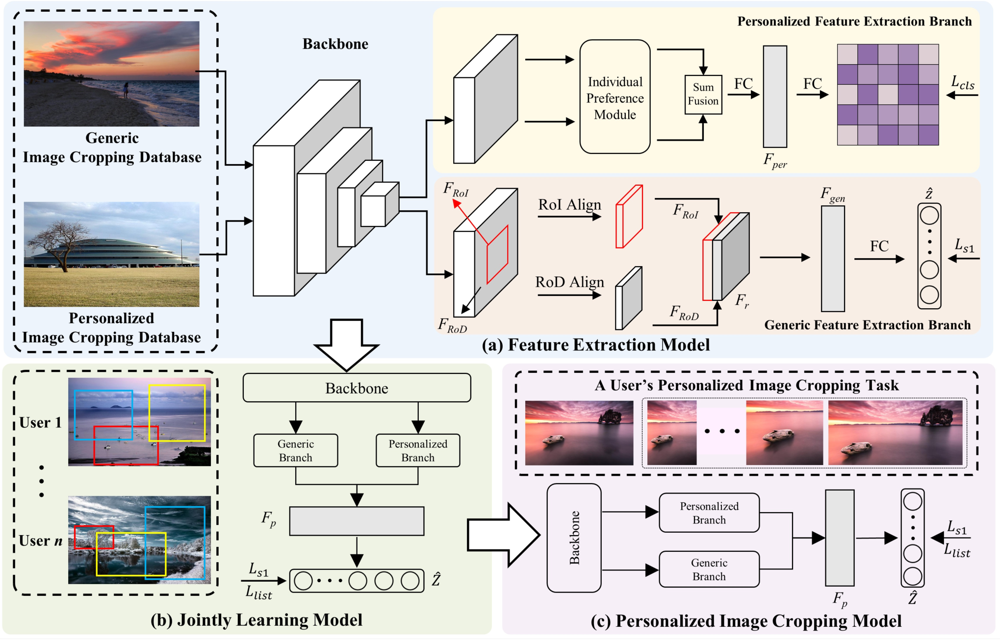
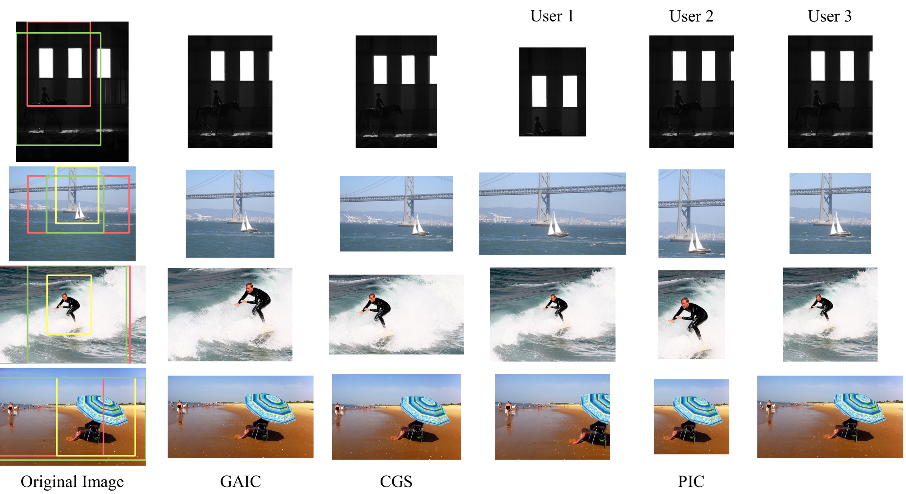

# Personalized Image Cropping

This is the official code of Personalized Image Cropping.

> Image cropping aims to find more attractive crops for users by recomposing images. With the development of mobile social media, the significance of this technology is increasingly evident. However, most existing methods focus on learning from average cropping results and rely on objective image features for image cropping. In this way, the subjectivity of image cropping and the preferences of people are often overlooked. Therefore, we analyze the difference between individual users and average users, proposing a new task called personalized image cropping (PIC). In contrast to existing approaches, the PIC model is required not only to comprehend general cropping features but also to capture personalized user preferences. To address this issue, we first extract the subjective features of users and the objective attributes of images to construct a prior model. Considering the difficulty in explicitly modeling subjective features, we propose an individual preference module to embed user attributes into a continuous latent space and explore their cropping preferences. The model is then jointly trained on PIC tasks to integrate two features, facilitating the transfer of prior knowledge to the evaluation of user-specific cropping. Finally, by fine-tuning with a small set of annotations, we can obtain the individualized PIC model for each user. Extensive quantitative and qualitative experiments demonstrate the necessity of the PIC task and the effectiveness of our proposed method.



```
pic
├─ dataloader
│  ├─ augmentations.py
│  ├─ finetune_cpc.py
│  ├─ pre_cpc.py
│  └─ prior_cpc.py
|
├─ finetune_pic.py                          // Fine-tuning test of the pic method on the cpc dataset
|
├─ gaic_cpc.py                              // GAIC method on the cpc dataset
|
├─ models
│  ├─ __init__.py
│  ├─ finetune_model.py                     // model of pic finetuning
│  ├─ pre_model.py                          // model of pic pre-traning
│  ├─ pretrained_model                      // pre-trained model
│  │  ├─ ShuffleNetV2.py
│  │  └─ mobilenetv2.py
│  ├─ prior_model.py                        // model of prior pic model
|
├─ pre_pic.py                               // pre-traning pic
|
├─ prior_pic.py                             // prior pic
|
├─ README.md
|
└─ tools
   ├─ loss.py
   ├─ m_Loss.py
   ├─ rod_align
   └─ roi_align

```

## Results

In the following figure, we give the results of our experiments for three different users, as well as the cropping results for several generic cropping methods. We can observe the differences in cropping preferences across users, and our model successfully identifies and analyzes the individual user preferences. For example, User 1 pays less attention to people, which is reflected in the first and fourth rows, he/she cuts the edges of people, and in the last row, the people are placed in a smaller area. Our model produces crops with more attention to the scenery and diminished emphasis on the person. Moreover, it is shown that User 2 and User 3 exhibit similar cropping preferences, as evidenced by the crops in the first row. More specifically, User 2 prefers the center composition, as observed in the third and fourth rows, the people are placed in the center of the image. User 3 seems to favor the composition of the Rule of Thirds, as seen in the fourth row. As a result, the PIC models offer similar content attention while offering varied options in compositional styles. On the other hand, although the two GIC methods can provide good generic cropping results, it is clear that they are difficult to satisfy the preferences of different users. This further proves the necessity of the PIC task and the effectiveness of our proposed PIC model.


